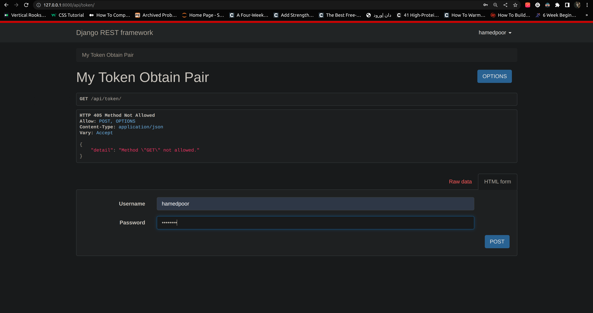
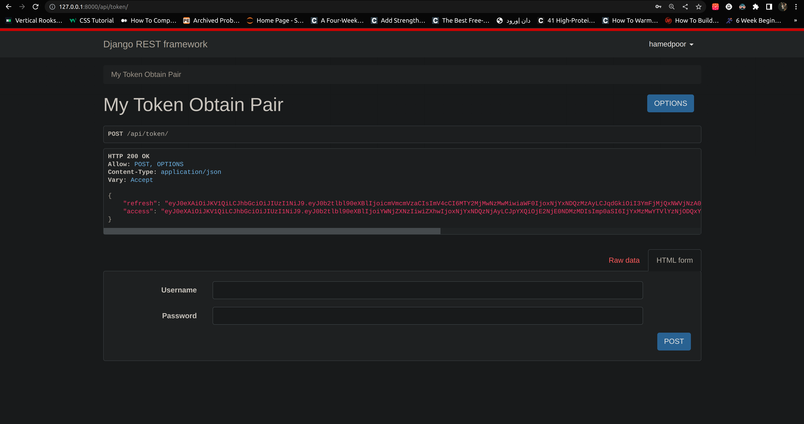
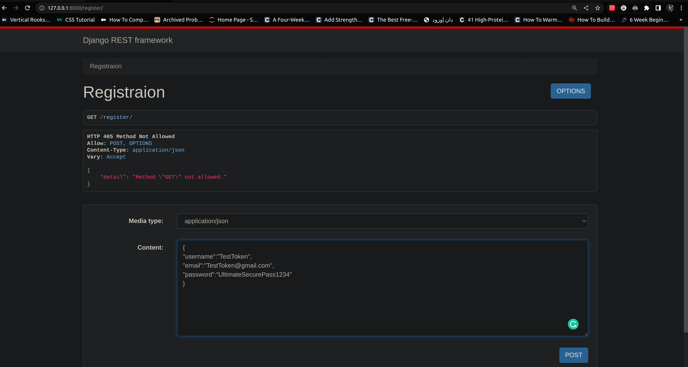
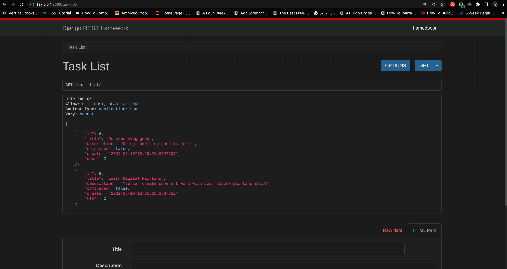
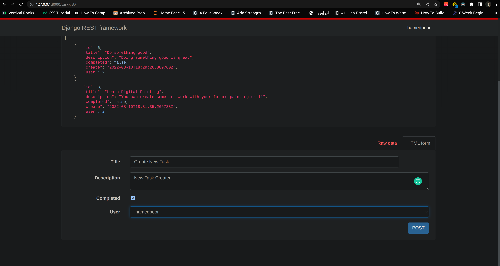
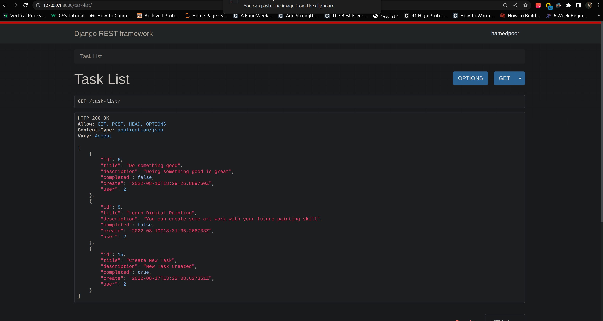
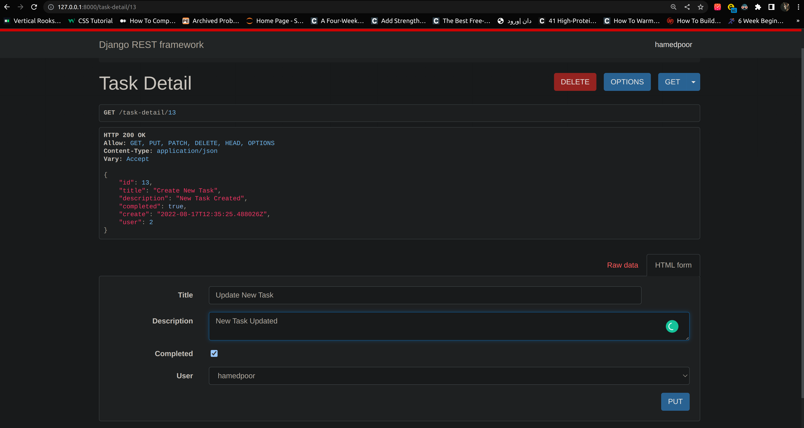
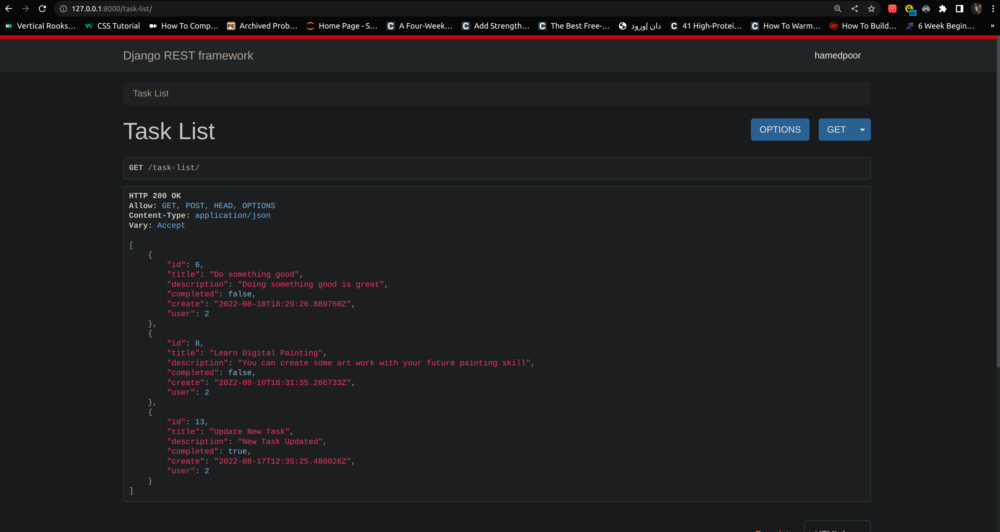
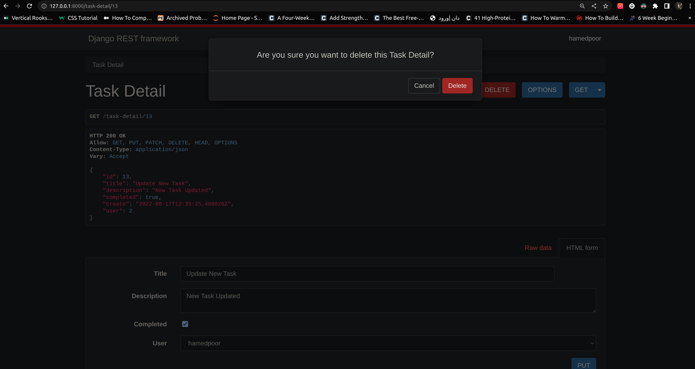
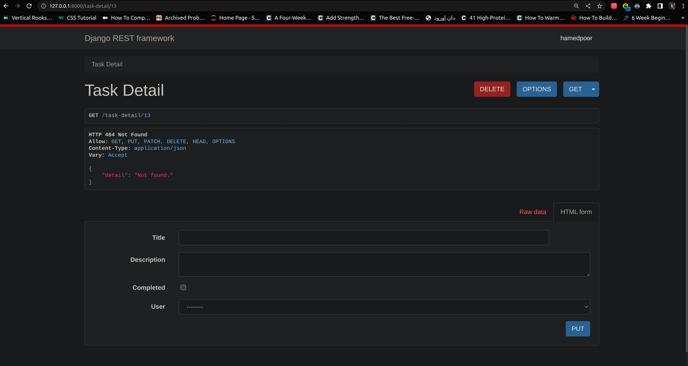

# To_Do_List_API With CRUD Functionality, JWT, Additional Token Authentication, Session Authentication and Custom Permisions

This is just backend part of app. We can add front end with view.js, react or ajax, anytime we want.

<h3>• Jason Web Token</h3>
<h4> if you are not a SuperUser you don't have permission for Using this route and creating tokens<h4>

 

<h3>• Registration</h3>

<h3>• Token Creation for User Instance</h3>
<h4> with django signals after registraion token will be create in data base</h4>

<h3>• Data list and Data Creating Functionality</h3>
<h4> if you are super user you can make new list item otherwise you'll be in read-only mode<h4>

<h3>• Detail of Specific Instance and Data Updating & Data Deleting Functionality </h3>
<h4> with the custom perimision that i wrote only creater of the task can change the information otherwise you can just read<h4> 

