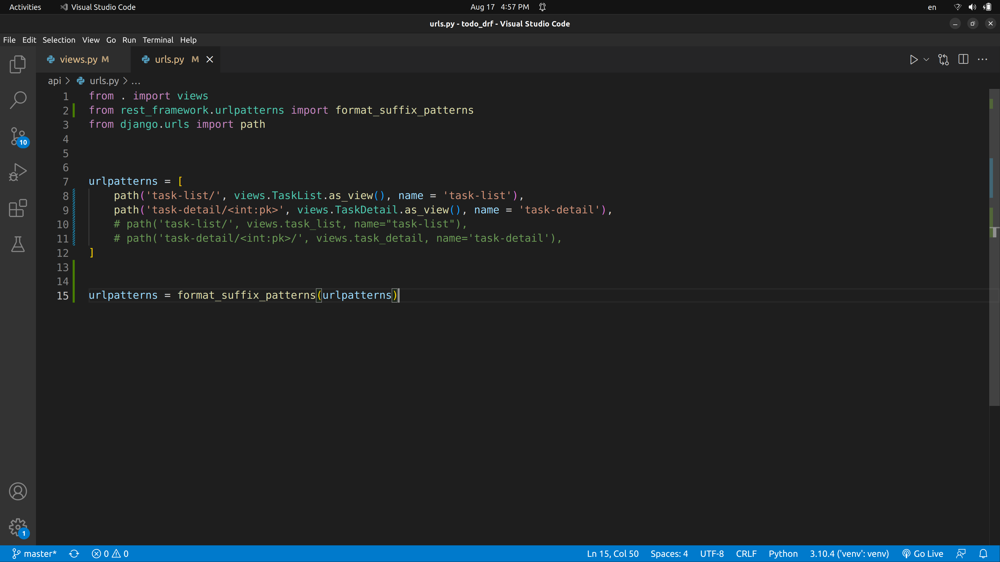

# To_Do_List_api
To do list api developed by Django rest frame work that has full CRUD functionality.
This is just backend part of app. We can add front end with view.js, react or ajax anytime we want.

<h2>• All Url Routs</h2>

<h2>• Data list</h2>

<h2>• Data Creating Functionality</h2>

<h2>• Data Updtaing Functionality</h2>

<h2>• Detail of Specific Instance </h2>

<h2>• Deta Deleting Functionality</h2>

