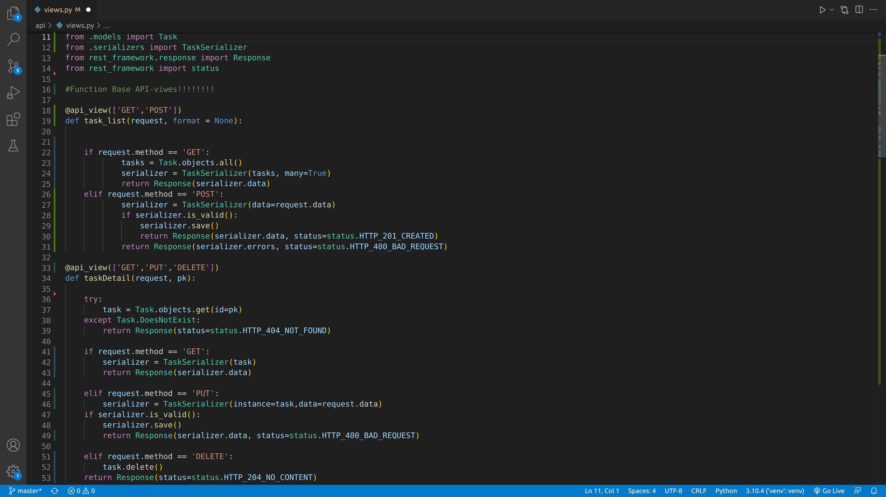
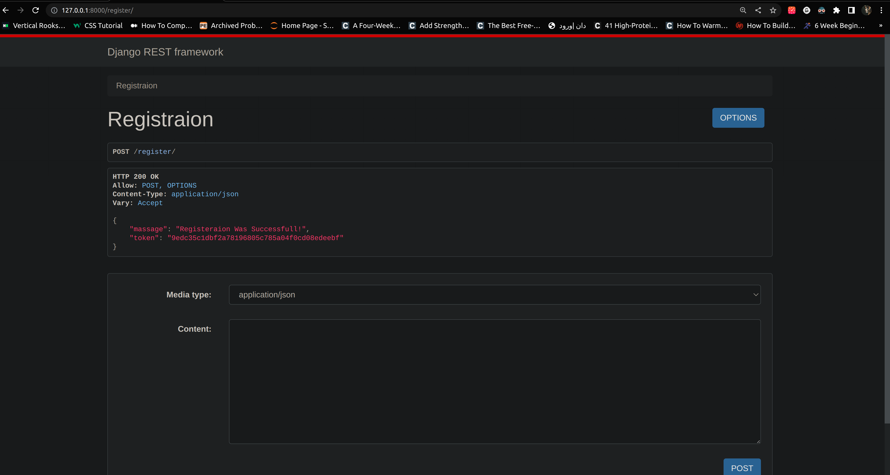

# To_Do_List_api With Token Authentication
To do list api developed by Django rest frame work that has full CRUD functionality and token authentication.
This is just backend part of app. We can add front end with view.js, react or ajax, anytime we want.

<h3> We can choose one these options for making a api:</h3>

<h4>• Funcation Base API-Views</h4>

<h4>• Class Base API-views: Using APIView Class</h4>

<h4>• Class Base API-views: Using Mixins</h4>

<h4>• Class Base API-views: Using Generic Class-basse Views</h4>
<h5> (most DRY and Concise Method)</h5>

<h4>• Registration</h4>

<h4>• Token Creation for User Instance</h4>

<h2>• Data list and Data Creating Functionality</h2>

<h2>• Detail of Specific Instance and Data Updating & Data Deleting Functionality </h2>

